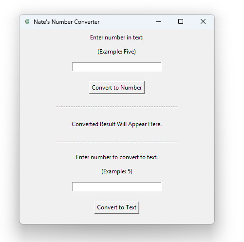

# Number-Converter
A Python program with Tkinter GUI that converts numbers between text and numeric form. Users can input a number in text (ex. "six hundred and twenty") or numeric form (ex. "620"), and the program converts it to the opposite format. Demonstrates text parsing, GUI development, and number conversion.



## __Features:__
- Convert numbers in text to their numeric equivalents (ex. "Five" → [5]).
  
  

- Convert numeric values into text (ex. [5] → "Five").
  
   

- Simple GUI built with Tkinter for an interactive user experience.
- Handles numbers ranging from 0 to 999,999,999.
- Can be compiled into an executable file (.exe) for easy distribution.
- Displays user errors when incorrect values are entered.
  
  

## __Installation__

1. **Clone this repository:**
   ```bash
   git clone https://github.com/NathanDubeau/number-converter.git

2. Install Dependencies
   ```bash
   pip install -r requirements.txt
   
4. Run The Program:
  Using the following command after navigating to the project folder:
    ```bash
      py NumConverterGUI.py
    ```

## __4. Usage__
__**Text to Number Conversion**__
  1. Enter a number written in text form (e.g., "Five hundred and twenty").
  2. Click the "Convert to Number" button to see the numeric version (e.g., 520).

__**Number to Text Conversion**__
  1. Enter a numeric value (e.g., 102).
  2. Click the "Convert to Text" button to see the written form (e.g., "One hundred and two").

## __5. License__
This project is licensed under the MIT License - see the [LICENSE](LICENSE) file for details.

## __6. Credits__
__**Written by: Nathan Dubeau**__

